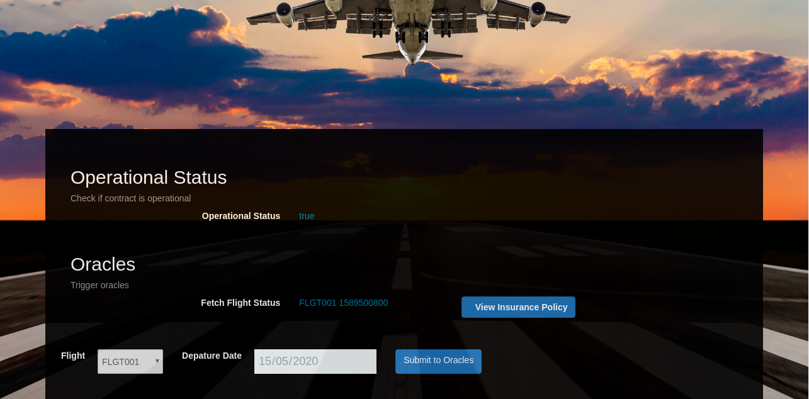

# FlightSurety

FlightSurety is a sample application project for Udacity's Blockchain course.

## Install

This repository contains Smart Contract code in Solidity (using Truffle), tests (also using Truffle), dApp scaffolding (using HTML, CSS and JS) and server app scaffolding.

To install, download or clone the repo, then:

`npm install`
`truffle compile`

## Develop Client
Create Ganache network having 30 accounts-
```
ganache-cli -m "<Mnemonic>" --gasLimit 300000000 --gasPrice 20000000000 -a 35
```

To run truffle tests:

`truffle test ./test/flightSurety.js`
`truffle test ./test/oracles.js`

To use the dapp:

`truffle migrate`
`npm run dapp`

To view dapp:

`http://localhost:8000`

## Develop Server

`npm run server`
`truffle test ./test/oracles.js`

## Deploy

To build dapp for prod:
`npm run dapp:prod`

Deploy the contents of the ./dapp folder

## How to use Dapp

For a successfull transaction, follow the following steps:

- Select flight and depature time, then submit the airline request to oracle.


- View insurance policy
- Passenger can `buy insurance`. On the popup, enter the insurance amount(Take note not to type in the amount, but use the input field arrows to select a value)  and click `Buy Insurance` to buy insurance, then close the popup

- Track your flight status. This will tell you if your flight has been delayed or not


- Withdraw if flight was delayed by clicking on `Payout`. A successful message is displayed if withdrawn was successful.


## Resources

* [How does Ethereum work anyway?](https://medium.com/@preethikasireddy/how-does-ethereum-work-anyway-22d1df506369)
* [BIP39 Mnemonic Generator](https://iancoleman.io/bip39/)
* [Truffle Framework](http://truffleframework.com/)
* [Ganache Local Blockchain](http://truffleframework.com/ganache/)
* [Remix Solidity IDE](https://remix.ethereum.org/)
* [Solidity Language Reference](http://solidity.readthedocs.io/en/v0.4.24/)
* [Ethereum Blockchain Explorer](https://etherscan.io/)
* [Web3Js Reference](https://github.com/ethereum/wiki/wiki/JavaScript-API)